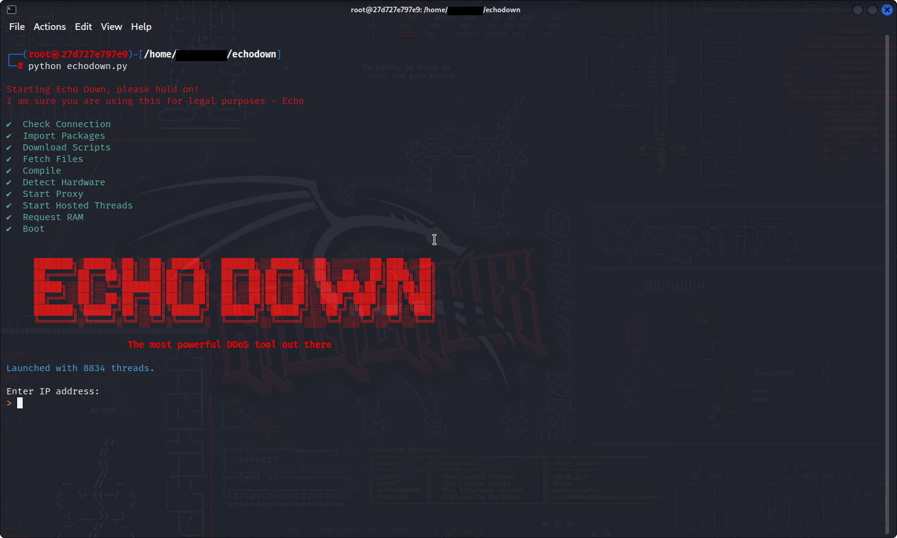

- [Echo Down](#echo-down)
  * [Installation](#installation)
  * [Usage](#usage)
  * [Contributing](#contributing)
  * [License](#license)

<small><i><a href='http://github.com/3kh0/readme-toc/'>Table of contents generated with readme-toc</a></i></small>


Echo Down is a tool that "fakes" a DDoS attack, it provides what a tool would look like in the regard of a DDoS tool but it does not perform the actual attack, all values are randomly generated

**Note: This tool is for educational purposes only. It does not perform a DDoS attack, all information is randomly generated.** If you are trying to perfrom a real DDoS attack, stop right now. That is illegal and can result in criminal charges and lawsuits.

## Installation

To use Echo Down, you will need to install the following dependencies:

- Python 3.x
- termcolor
- halo
- time
- random
- re

You can install all of these dependencies using pip:
```bash
pip install -r requirements.txt
```

## Usage

To use Echo Down, simply run the `echodown.py` file:
```bash
python echodown.py
```
The tool will then ask you to enter the IP address of the target server and the protocol to use (TCP, UDP, or HTTP).

Once you have entered this information, Echo Down will most definitely start sending a very real and high volume of traffic to the target server. You can use CTRL+C to stop the "attack" at any time.



## Contributing

If you would like to contribute to Echo Down to make it feel more "real", please submit a pull request, if you have any suggestions, create a issue.

## License

Echo Down is licensed under the MIT License. See the [LICENSE](LICENSE) file for details.
